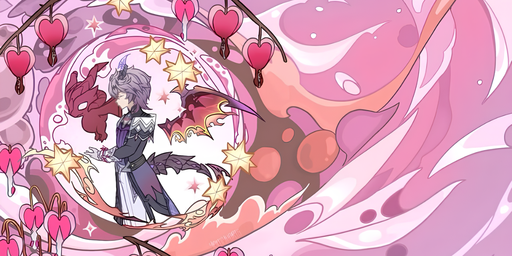

  

# About Me

  &#8287;&#8287;&#8287;&#8287;&#8287;

  &#8287;&#8287;&#8287;&#8287;&#8287;

## I'm currently learning:

- 
- 
- 
- 
- 
- 

> Always learning something new.

# 🚀 Featured Projects

✨ Things I'm building one commit at a time ✨

 

